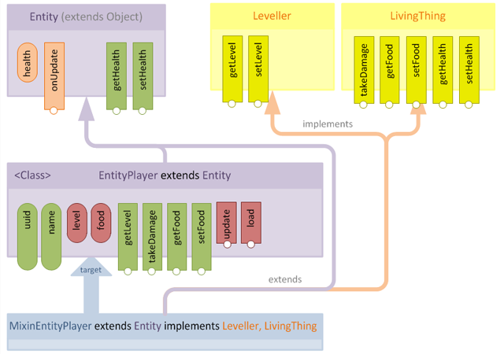
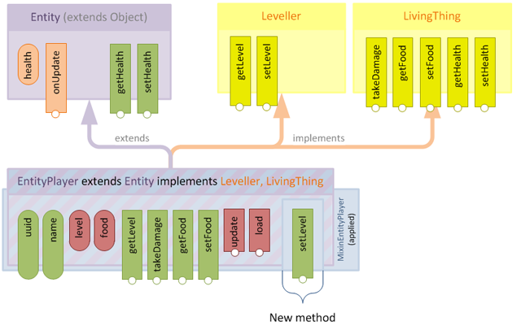
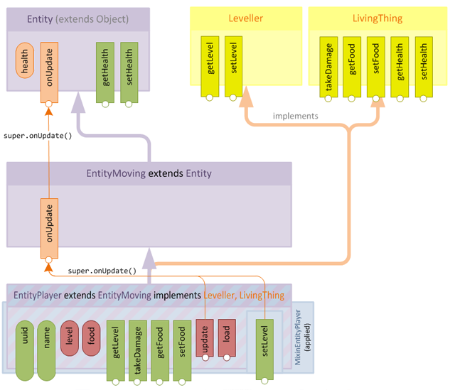

# Mixin

**阅读前请先阅读 Coremod 教程**

## 原理

- 目标类：Mixin 实际注入的类（@Mixin 注解中的类）

- 公开区域：对其它对象可见

  - 公共方法和字段
  - 父类的公共方法和字段
  - 从父类继承的幽灵方法
  - Mixin 混入的公共方法和字段

- 静态绑定与动态绑定

  - 静态绑定 Statically Bound：使用 INVOKESPECIAL 和 INVOKESTATIC 操作符表示，总是引用成员
    - 通过 super 限定符调用
    - 所有字段访问
    - private 和 static 方法
  - 动态绑定 Dynamically Bound：使用 INVOKEVIRTUAL 表示，实际调用时才解析他们的目标，允许子类重写
    - 通过 this 限定符调用
    - 通过接口类型调用

- 方法签名：一个方法的签名为一组参数及其返回值

  > public ThingType getThingAtLocation(double scale, int x, int y, int z, boolean squash)
  >
  > 签名：(DIIIZ)Lcom/mypackage/ThingType;
  >

- 接口方法：只要方法签名与接口中的方法签名匹配，则认为类方法实现了接口方法（动态绑定）

- 鸭子类型：允许基于对象的成员是否存在来访问或调用对象成员

  - 若能将 implements 子句插入到目标类中，且接口方法存在，那就能通过接口在目标类中调用他们
  - Mixin 做了些什么：
    - 类和接口之间的关系非常脆弱，只要稍加修改就能以多种方式做些事情
    - 可以利用 Java 动态绑定编写能通过编译的代码，即使不能运行。关键是将 implements 子句添加到目标对象
    - 编译时，super 关键字的父类调用为静态绑定，意味着指定 super 时，要额外考虑指定的是啥

- Mixin 的任务

  - 运行时将我们所选的接口应用到目标类
  - 为接口中声明但目标类中不存在的方法插入一个方法实现

  

  应用后

  

  - super 静态绑定

    - 为保证语义一致性，Mixin 会在应用时更新所有的 INVOKESPECIAL 操作符，分析目标类的父类层次结构，找到该方法的最特化版本

      - 因此 在注入类中使用 super，调用的是注入类父类的方法

    - 这种操作开销很高，因此只在注入类和目标类的父类不同时，才会执行这种步骤，因此尽量将 Mixin 类与目标类继承相同的父类

      

## 加载

### 配置 gradle.build

```groovy
// 向 buildscript 中添加 mixingradle
// 2019.10.16 mixingradle 版本为 0.6，mixin 版本为 0.7.11，可从 maven 仓库中查看
buildscript {
    repositories {
        // ...
        maven { url = "https://repo.spongepowered.org/maven/" }
    }
    dependencies {
        // ...
        classpath 'org.spongepowered:mixingradle:0.6-SNAPSHOT'
    }
}

// 应用并配置
apply plugin: 'org.spongepowered.mixin'

mixin {
    // 反混淆表。推荐 mixins.<modid>.refmap.json
    add sourceSets.main, "mixins.examplemod.refmap.json"
}

// 依赖 mixin
repositories {
    maven {
        name = "SpongePowered Repo"
        url = "https://repo.spongepowered.org/maven/"
    }
}

dependencies {
    // ...
    provided('org.spongepowered:mixin:0.7.11-SNAPSHOT') {
        exclude module: 'guava'
        exclude module: 'commons-io'
        exclude module: 'gson'
    }
}

// 向 manifest 中写入 ITweaker 加载
jar {
    manifest.attributes([
            "TweakClass": "<ITweaker 全类名>"
    ])
}
```


### Coremod

Mixin 为 Coremod 调用，需要被 Coremod 的方法加载

当仅作为 Coremod 加载时，可使用 第一类Tweaker引导Mixin

```groovy
// 向 manifest 中写入 ITweaker 加载
jar {
    manifest.attributes([
        "TweakClass": "org.spongepowered.asm.launch.MixinTweaker"
        "TweakOrder": 0
        "MixinConfigs": "mixins.mymod.json"
    ])
}
```


### 创建 ITewaker

应使用 ITweaker 而非 FMLTweaker

> 原因：ITweaker 使用 sun.misc.Launcher$AppClassLoader 加载，而 IFMLLoadingPlugin 由 LaunchClassLoader 加载

```java
public class MixinTweaker implements ITweaker {

    @Override
    public void injectIntoClassLoader(LaunchClassLoader classLoader) {
        // 加载 Mixin
        MixinBootstrap.init();
        Mixins.addConfiguration("mixins.examplemod.json");
        // 若此 mod 将以普通 mod 读取，则需要从 IgnoredMods 中移除，否则不会读取 @Mod 注解
        CodeSource source = getClass().getProtectionDomain().getCodeSource();
        if (source != null) {
            URL location = source.getLocation();
            try {
                File file = new File(location.toURI());
                if (file.isFile()) {
                    CoreModManager.getIgnoredMods().remove(file.getName());
                }
            } catch (URISyntaxException e) {
                e.printStackTrace();
            }
        } else {
            Logger logger = LogManager.getLogger();
            logger.warn("No CodeSource, if this is not a development environment we might run into problems!");
            logger.warn(this.getClass().getProtectionDomain());
        }
    }

    @Override
    public void acceptOptions(List<String> args, File gameDir, File assetsDir, String profile) { }

    @Override
    public String getLaunchTarget() { return ""; }

    @Override
    public String[] getLaunchArguments() { return new String[0]; }
}

```

若非要使用 FMLTweaker 则

```java
public class FMLMixinLoader implements IFMLLoadingPlugin {

    public static void initMixin() {
        MixinBootstrap.init();
        Mixins.addConfiguration("mixins.examplemod.json");
    }

    @Override
    public void injectData(Map<String, Object> data) {
        // 打破 Forge Mod 加载规则，使用 AppClassLoader 加载
        try {
            ClassLoader appLoader = Launch.class.getClassLoader();
            MethodUtils.invokeMethod(appLoader, true, "addURL", getClass().getProtectionDomain().getCodeSource().getLocation());
            MethodUtils.invokeStaticMethod(appLoader.loadClass(getClass().getName()), "initMixin");
        } catch (NoSuchMethodException | IllegalAccessException | InvocationTargetException | ClassNotFoundException e) {
            e.printStackTrace();
        }
    }

    @Override
    public String getModContainerClass() { return null; }

    @Nullable
    @Override
    public String getSetupClass() { return null; }

    @Override
    public String[] getASMTransformerClass() { return new String[0]; }

    @Override
    public String getAccessTransformerClass() { return null; }
}
```

在 build.gradle 中修改manifest：

```groovy
jar {
    manifest {
        attributes([
                "FMLCorePlugin": "com.example.ExamplePlugin",
                "FMLCorePluginContainsFMLMod": true
        ])
    }
}
```

其中：

- `FMLCorePlugin`属性是`IFMLLoadingPlugin`实现类的完整类名
- `FMLCorePluginContainsFMLMod`属性标记CoreMod的jar中是否还含有普通的Mod，如果为false，FML不会尝试寻找`@Mod`注解并加载普通Mod

>  `jar`是会在`build`等task打包时才会被执行，在`runClient`之类的测试运行时并不会被读取到，如果需要在测试运行时使用CoreMod，还需要在`build.gradle`中加入jvm参数的设置：
>
>  ```groovy
> minecraft {
>     ...
>     clientJvmArgs += "-Dfml.coreMods.load=com.example.ExamplePlugin"
>     serverJvmArgs += "-Dfml.coreMods.load=com.example.ExamplePlugin"
> }
>  ```
>
> 

## 配置

> 复制自 [Mixin]( https://xfl03.gitbook.io/coremodtutor/5/5.1 )

> 所有可配置设定均在 org.spongepowered.asm.mixin.transformer.MixinConfig 中查询

在`src/main/resources`文件夹中新建一个json文件，推荐命名为`mixins.<modid>.json`

配置文件中的所有可配置项参考[这里](https://github.com/SpongePowered/Mixin/blob/master/src/main/java/org/spongepowered/asm/mixin/transformer/MixinConfig.java)。

在[Wiki](https://github.com/SpongePowered/Mixin/wiki/Introduction-to-Mixins---The-Mixin-Environment)中的相关属性解释：

- `package`: Mixin注入类所在的父包，这个包将会被添加到`LaunchClassLoader`的`transformerExceptions`中去；

- `mixins`: 客户端和服务端都运行的Mixin注入类（填写相对于`package`属性的全类名，下同）；

- `client`: 仅在客户端运行的Mixin注入类；

- `server`: 仅在服务端运行的Mixin注入类；

- `refmap`: 指定Mixin的混淆映射json文件名（需要与MixinGradle中设置的一致）；

- `priority`: 指定配置文件被载入的优先级，默认为1000；

- `plugin`: 指定Mixin插件类名，这个类需要实现 [`IMixinConfigPlugin`](https://github.com/SpongePowered/Mixin/blob/master/src/main/java/org/spongepowered/asm/mixin/extensibility/IMixinConfigPlugin.java) 接口，这个插件允许程序在运行时修改Mixin配置（参考[扩展]()）；

- `required`: 决定是否确保所有Mixin注入类都能找到目标类，如果设置为`true`，一旦未能找到，那么就会抛出异常并终止游戏运行；

- `minVersion`: 指定所使用的Mixin功能出现的最低版本，如果运行中的Mixin版本低于该版本，那么就会忽略高版本Mixin中的功能；

- `setSourceFile`: 决定是否让注入类覆盖目标类的 `source file` 属性，如果设置为`true`，我们大概能在打印调用堆栈时看到

  ```
    at net.minecraft.client.gui.GuiMainMenu.func_73863_a(MixinGuiMainMenu.java:514)
  ```

    而不是原先的

  ```
    at net.minecraft.client.gui.GuiMainMenu.func_73863_a(GuiMainMenu.java:514)
  ```

一个最基本的配置文件如下：

```
{
	"package": "com.example.mixins",
	"mixins": [],
	"client": [],
	"server": []
}
```

## 注入

### @Mixin

该注解被注解到类上，用于标记被注入的类

- value

  标记一个或多个目标类

- targets

  标记一个或多个非公有类或匿名类

- priority

  注入优先级

- remap

  目标类在 MixinGradle 混淆表中不存在，则建议设为 true

*注入类尽量使用 abstract 修饰。虽然不必要，但在 IDE 调用时会很有用：用户不能试图实例化注入类，避免必须实现声明接口的每个方法的要求*

*注入类最好实现与目标类相同的超类，保持任何静态编译的语义编译到 Mixin 类中*


### 成员

#### @Shadow

被注解字段用于表示原本存在于目标类的字段，其可被注入方法访问且不会合并到目标类中

不可引用父类对象

-  aliases：别名。有些成员不存在于开发环境，但会存在于字节码文件中，且被混淆了。此时，被注解方法为 MCPName，aliases 为实际名

  > 例如：内部类直接访问外部类时，会通过一个变量访问，一般名为 this$0（可通过 ByteCodeOutline 等工具查看）
  >
  > ```java
  > @Mixin(targets = "net.minecraft.client.network.NetworkPlayerInfo$1")
  > public abstract class MixinNetworkPlayerInfo$1 {
  >     @Shadow(aliases = "this$0")
  >     private NetworkPlayerInfo field_177224_a;
  > }
  > ```
  >
  > 


#### @Final

标记在被 @Shadow 注解的字段上

该字段被 final 修饰


#### @Mutable

标记在被 @Final 注解的字段上

表示该成员虽然是 final 的，但可被修改（相当于去除了 final 标记）


#### @Accessor

访问非公成员变量，注解一个抽象方法

*方法名以 get/set/is 开头，剩余部分与目标字段一致，首字母大写*

- get 开头的方法：用于获取一个字段，返回类型与字段类型相同，方法不能有参数
- is 开头的方法：用于获取一个 boolean 字段，返回值为 boolean，方法不能有参数
- set 开头的方法：用于修改一个字段，返回类型 void，只能有一个参数，类型与目标字段类型一致

*若指定 value 属性，则该属性值应与字段一致，方法名可以随便取了，但返回值和参数仍要符合上述规则*


#### this

若需要传入 this 参数，可直接强转

```java
@Mixin(LayerCape.class)
public class MixinLayerCape {
    // private HyperiumLayerCape hyperiumLayerCape = new HyperiumLayerCape(this);
    private HyperiumLayerCape hyperiumLayerCape = new HyperiumLayerCape((LayerCape) (Object) this);
}
```


#### super

要访问父类成员，只需要与目标类继承同一类即可

若父类需要构造方法，随便写个就行，不会合并到目标类中

若目标类为泛型类，注入类使用相同泛型即可


#### 添加成员

直接在 Mixin 类中添加 可以直接在注入类中调用，若在外部调用则有限制

推荐方法

*创建一个接口，实现对应方法，强转接口访问*

```java
public interface IMixinMinecraft {
    String getTitle();
}

@Mixin(Minecraft.class)
public abstract class MixinMinecraft implements IMixinMinecraft {
    private String title = "MyCustomTitle";

    @ModifyConstant(method = "createDisplay", constant = @Constant(stringValue = "Minecraft 1.12.2"))
    private String modifyConstant_createDisplay(String title) {
        return this.getTitle();
    }

    @Override
    public String getTitle() {
        return this.title;
    }
}

public void foo() {
    ((IMixinMinecraft) Minecraft.getMinecraft()).getTitle();
}
```


其他方法：*反射*


### 方法


#### @Overwrite：重写目标方法

允许注入方法重写整个目标方法

- 重写方法访问级不能低于目标方法访问级，注意其他 mod 修改目标方法访问级

- 注入方法签名应与目标方法相同


#### @Inject：方法内增加方法

允许在目标方法体内某位置添加自己指定的方法

- `id`: 指定此注解的识别名称，不设置则默认为注入的目标方法（注入失败时会在日志中显示）

- `method`: 用于指定注入的一个或多个目标方法，以下几种写法都是合法的：  

  - `createDisplay`

  - `createDisplay()V`

  - `net.minecraft.client.Minecraft.createDisplay`

  - `net/minecraft/client/Minecraft.createDisplay`

  - `Lnet/minecraft/client/Minecraft;createDisplay`

  - `net.minecraft.client.Minecraft.createDisplay()V`

  - `net/minecraft/client/Minecraft.createDisplay()V`

  - `Lnet/minecraft/client/Minecraft;createDisplay()V`  

    需要注意的是：如果一个类中含有多个同名方法，而你没有指定注入的方法签名，那么Mixin就会只注入匹配到的第一个方法。如果你想注入每个同名方法，可以用下面这种写法：

  - `createDisplay*` : （其实就是名称末尾加个`*`）

- `slice`: 指定一个或多个`@Slice`注解，用于指定注入位置的存在范围

  - id：注解识别名称，给 @At 识别用
  - from：用 @At 匹配范围从哪开始
  - to：到哪结束

- `at`: 指定一个或多个`@At`注解，用于指定注入的位置

  - value=HEAD：方法开头

  - value=RETURN：return 操作符之前

    - ordinal：注入到第几个 RETURN 之前。从 0 计数。默认注入到所有 return 前

    - 这是唯一一个可注入构造方法中的位置

      ```java
      @Inject(method = "<init>", at = @At("RETURN"))
      ```

    - 若注入到一个带返回值的方法中，使用  CallbackInfoReturnable::getReturnType 将返回目标函数返回值，其他返回 null

  - value=TAIL：最后一个 RETURN 之前

    - 不一定等同于代码中最后一个 return 前，需要查看字节码确认

  - value=NEW：注入到 NEW 操作符前

    - args：class。当 target 不存在时使用，用于指定实例化类型

      - class=net/minecraft/client/tutorial/Tutorial

    - target：当 args.class 未指定时使用

      - net/minecraft/client/tutorial/Tutorial

      -  (Lnet/minecraft/client/Minecraft;)Lnet/minecraft/client/tutorial/Tutorial;

        表示指定实例化对象的构造

    - ordinal：注入到哪个匹配的目标之前。从 0 计数，不指定则匹配所有

    > NEW 与 INVOKE(\<init>)
    >
    > @At(value = "NEW", target = "(Lnet/minecraft/client/Minecraft;)Lnet/minecraft/client/tutorial/Tutorial;")
    >
    > 匹配 NEW 操作符
    >
    > 构造函数参数还未调用，即将计算构造函数
    >
    > @At(value = "INVOKE", target = "Lnet/minecraft/client/tutorial/Tutorial;(Lnet/minecraft/client/Minecraft;)V")
    >
    > 匹配 INVOKESPECIAL 操作符
    >
    > 构造函数参数已经调用完毕，即将执行构造函数

  - value=INVOKE：注入到一个方法调用前

    - args：允许接受一个 log=\<boolean> 形式的参数。log=true 表示会输出相关日志信息
    - target：带有完整限定名的方法签名，若不指定则匹配所有方法调用
      -  org.lwjgl.opengl.Display.setTitle(Ljava/lang/String;)V
      -  org/lwjgl/opengl/Display.setTitle(Ljava/lang/String;)V
      - Lorg/lwjgl/opengl/Display;setTitle(Ljava/lang/String;)V
    - ordinal：注入匹配的第几个目标，从 0 开始，不指定则注入所有匹配目标

  - value=INVOKE_STRING：注入到一个仅有一个 String 类型参数且无返回值的方法调用前，且传入的字符串必须为常量

    - args
      - idc=字符串值。该属性必须存在
      - log 同 INVOKE
    - target：同 INVOKE
    - ordinal：同 INVOKE

  - value=INVOKE_ASSIGN：注入到一个带有返回值的方法调用之后（*STORE 操作符后）

    - args：同 INVOKE
    - target：同 INVOKE
    - ordinal：同 INVOKE，但注入的位置时函数调用后

  - value=FIELD：注入到一个字段引用前

    - args
      - array：当字段为数组时可使用
        - array=get：数组元素被引用
        - array=set：数组元素被赋值
        - array=length：数组 length 属性被引用时
      - log：同 INVOKE
    - target：带完整限定名的字段签名。不指定则匹配所有符合 opcode 字段引用
      -  net.minecraft.client.Minecraft.instance:Lnet/minecraft/client/Minecraft;
      -  net/minecraft/client/Minecraft.instance:Lnet/minecraft/client/Minecraft;
      -  Lnet/minecraft/client/Minecraft;instance:Lnet/minecraft/client/Minecraft;
    - opcode：指定匹配操作符，不指定则匹配所有 args.array 和 target 引用
      - 178：GETSTATIC
      - 179：PUTSTATIC
      - 180：GETFIELD
      - 181：PUTFIELD
    - 若 target 和 opcode 都不指定，则匹配所有字段引用
    - ordinal：指定注入到哪个 args.array，target 和 opcode 匹配前。不指定则匹配所有

  - value=CONSTANT：注入到一个常量被引用之前

    - args：

      - nullValue=\<boolean>：匹配 null 引用

      - intValue：匹配 int 引用（使用 if 与 0 比较除外）

      - floatValue，longValue，doubleValue，stringValue 同 intValue

      - class：匹配 类名.class 引用，填写类完整限定名 

        - 如 class=net.minecraft.client.Minecraft

      - log：同 INVOKE

      - expandZeroConditions：使用 if 与 0 比较 (if(a>0)之类) 时调用

        > 特殊情况：使用 if 比较数字与 0 的大小
        >
        > 此时，不会出现 ICONST_0 之类的方法引用 0 而是类似 if(x.isGreatorOrEqualToZero()) 的形式
        >
        > ```java
        > public int foo(int num) {
        >     if (num > 0)
        >         return 11;
        >     return 22;
        > }
        > ```
        >
        > ```smali
        >    L0
        >     LINENUMBER 6 L0
        >     ILOAD 1  // num 入栈
        >     IFLE L1  // 这里直接跳转，而没有引用0
        >    L2
        >     LINENUMBER 7 L2
        >     BIPUSH 11
        >     IRETURN
        >    L1
        >     LINENUMBER 8 L1
        >    FRAME SAME
        >     BIPUSH 22
        >     IRETURN
        >    L3
        > ```
        >
        > 因为 IFEQ，IFNE 等本身就是与 0 比较并跳转

        -  LESS_THAN_ZERO：<0
        -  LESS_THAN_OR_EQUAL_TO_ZERO ：<=0
        -  GREATER_THAN_OR_EQUAL_TO_ZERO ：>=0
        -  GREATER_THAN_ZERO ：>0
        - 要匹配多个使用 , 分割

    - ordinal：指定注入到哪个匹配的 args 之前，从 0 计数，不指定则所有

  - value=JUMP：注入到跳转之前

    - ordinal：注入到哪个 opcode 前，0，全部。。。
    - opcode：匹配操作，不指定则全部
      - `153`: 表示匹配`IFEQ`操作符
      - `154`: 表示匹配`IFNE`操作符
      - `155`: 表示匹配`IFLT`操作符
      - `156`: 表示匹配`IFGE`操作符
      - `157`: 表示匹配`IFGT`操作符
      - `158`: 表示匹配`IFLE`操作符
      - `159`: 表示匹配`IF_ICMPEQ`操作符
      - `160`: 表示匹配`IF_ICMPNE`操作符
      - `161`: 表示匹配`IF_ICMPLT`操作符
      - `162`: 表示匹配`IF_ICMPGE`操作符
      - `163`: 表示匹配`IF_ICMPGT`操作符
      - `164`: 表示匹配`IF_ICMPLE`操作符
      - `165`: 表示匹配`IF_ACMPEQ`操作符
      - `166`: 表示匹配`IF_ACMPNE`操作符
      - `167`: 表示匹配`GOTO`操作符
      - `168`: 表示匹配`JSR`操作符
      - `198`: 表示匹配`IFNULL`操作符
      - `199`: 表示匹配`IFNONNULL`操作符

  - value=LOAD：注入到 *LOAD 操作符前

    - ordinal：注入到哪个 *LOAD 前。计数从 0 开始，从 @ModifyVariable 中的 ordinal 数起

  - value=STORE：注入到 *STORE 操作符之后

    - ordinal：同 LOAD

- `cancellable`: 决定目标方法调用完注入方法后是否取消运行接下来的部分并直接返回（设置为`true`之后需要在注入方法中手动调用cancel方法）

- `require`: 指示匹配次数最少应该有多少次（运行时少于这个次数会抛出异常）

- `allow`: 指示匹配次数最多应该有多少次（设置得比`require`小或者小于1则会忽略，运行时多于这个次数会抛出异常）

- locals：用于捕获局部变量表

  **混淆抹除了局部变量表，Mixin提供的表是根据字节码推断出，容易被其他mod修改**

  - NO_CAPTURE：默认 不捕获
  - PRINT：捕获。不注入。捕获后打印到控制台。用于确定局部变量表
  - CAPTURE_FAILSOFT：捕获。一旦捕获失败，不注入该方法，日志生成一条错误
  - CAPTURE_FAILHARD：捕获。一旦捕获失败，抛出错误，终止游戏
  - CAPTURE_FAILEXCEPTION：捕获。一旦捕获失败，生成一个异常，并注入。

  *获取了插入点作用域可用的变量表后，可以放入函数参数以供调用*

  ```java
  // 获取局部变量表
  @Inject(method = "setWindowIcon",
          at = @At(value = "INVOKE", 
                  target = "Lnet/minecraft/client/resources/DefaultResourcePack;" +
                          "getInputStreamAssets(Lnet/minecraft/util/ResourceLocation;)" +
                          "Ljava/io/InputStream;"),
          locals = LocalCapture.PRINT)
  private void inject_setWindowIcon(CallbackInfo ci) {}
  
  // 控制台
  // LOCAL                  TYPE  NAME                                                        
  // [  0]             Minecraft  this
  // [  1]           Util$EnumOS  util$enumos                                        <capture>
  // [  2]           InputStream  inputstream                                        <capture>
  // [  3]           InputStream  inputstream1                                       <capture>
  // [  4]                     -
  // [  5]                     -
      
  
  // 注入方法
  // 不一定要把预期参数全填上，也可以只选择前几个
  @Inject(
          method = "setWindowIcon",
          at = @At(value = "INVOKE",
                  target = "Lnet/minecraft/client/resources/DefaultResourcePack;" +
                          "getInputStreamAssets(Lnet/minecraft/util/ResourceLocation;)" +
                          "Ljava/io/InputStream;"),
          locals = LocalCapture.CAPTURE_FAILSOFT
  )
  private void inject_setWindowIcon(CallbackInfo ci, 
                                    Util.EnumOS util$enumos, 
                                    InputStream inputstream) {}
  ```


*注入方法推荐使用 private 访问等级*

**若目标方法为静态，注入方法必为静态**

*若有必要，可传入参数，参数列表与目标方法相同，且位于注入方法参数开头*

**若目标方法无返回值，则注入方法必须存在一个  CallbackInfo  类型参数，该参数位于方法参数（如果存在）的最后**

```java
// 如果目标方法无返回值类型，那么在添加目标方法参数之后必须有一个参数，且必须是 CallbackInfo 类型。
@Inject(method = "createDisplay",
        // 表示注入在方法被调用之前
        at = @At(value = "INVOKE",
                // 把注入点往后移一位，也就变成注入在方法被调用之后
                shift = At.Shift.AFTER,
                target = "Lorg/lwjgl/opengl/Display;setTitle(Ljava/lang/String;)V",
                // Display.setTitle 并不存在于混淆表中，所以设置 remap 属性为 false
                remap = false))
private void inject_createDisplay(CallbackInfo ci) {
    Display.setTitle("MyCustomTitle");
}
```


**若目标方法有返回值，则注入方法必须存在一个  CallbackInfoReturnable  类型参数，泛型为返回值类型，该参数位于方法参数（如果存在）的最后**

```java
// setReturnValue() 方法中包含了 cancel() 方法
@Inject(method = "getLimitFramerate",
        at = @At("HEAD"),
        cancellable = true)
private void inject_getLimitFramerate(CallbackInfoReturnable<Integer> cir) {
    if (!Display.isActive()) {
        cir.setReturnValue(5);
    }
}
```

#### @Surrogate 

当我们已知某个 mod 可能会对目标方法局部变量表进行修改，或匹配的多个注入点可用的局部变量不同，则可以对注入方法进行重载，并使用该注解

*@Surrogate 注解的方法参数个数不能多于 @Inject，因此请将参数最多的方法标记为 @Surrogate*

*使用 @Surrogate 必须在方法参数中写全所有局部变量*

```java
// 例：已知某一 mod 会给setWindowIcon 的注入点插入 int int 两个局部变量
// 则 该方法局部变量类型则变为 Minecraft, int, int, Util$Enum0$, InputStream, InputStream
@Inject(method = "setWindowIcon",
        at = @At(value = "INVOKE",
                target = "Lnet/minecraft/client/resources/DefaultResourcePack;" +
                        "getInputStreamAssets(Lnet/minecraft/util/ResourceLocation;)" +
                        "Ljava/io/InputStream;"),
        locals = LocalCapture.CAPTURE_FAILSOFT)
private void inject_setWindowIcon(CallbackInfo ci, int i, int j,
                                  Util.EnumOS util$enumos,
                                  InputStream inputstream,
                                  InputStream inputstream1) { }
@Surrogate
private void inject_setWindowIcon(CallbackInfo ci,
                                  Util.EnumOS util$enumos,
                                  InputStream inputstream,
                                  InputStream inputstream1) { }
// 注意这个方法参数会多出一个 CallbackInfo
// 因为这个例子下指定的 @Inject.at 会在目标方法里匹配两次，而且这两次恰好在同一作用域当中
// 所以后面的 CallbackInfo 正是匹配第一次时的那个。
@Surrogate
private void inject_setWindowIcon(CallbackInfo ci,
                                  Util.EnumOS util$enumos,
                                  InputStream inputstream,
                                  InputStream inputstream1,
                                  CallbackInfo ci1) { }
```

#### @Group

当要对某个 @Inject 或 @Surrogate 注解的方法独立计数，而不是并入到 require 和 allow 次数检查中时，使用该注解

- name：名称，报错时在日志中显示
- min：require
- max：allow

```java
// 不会报错，因为这个方法最多只能匹配到一次
@Surrogate
@Group(max = 1)
private void inject_setWindowIcon(CallbackInfo ci,
                                  Util.EnumOS util$enumos,
                                  InputStream inputstream,
                                  InputStream inputstream1) {}
​// 不会报错，因为两个方法总共最少能匹配到两次
@Inject(method = "setWindowIcon",
        at = @At(value = "INVOKE",
                target = "Lnet/minecraft/client/resources/DefaultResourcePack;" +
                        "getInputStreamAssets(Lnet/minecraft/util/ResourceLocation;)" +
                        "Ljava/io/InputStream;"),
        locals = LocalCapture.CAPTURE_FAILSOFT,
        require = 2)
private void inject_setWindowIcon(CallbackInfo ci,
                                  Util.EnumOS util$enumos,
                                  InputStream inputstream,
                                  InputStream inputstream1,
                                  CallbackInfo ci1) {}
```


#### @Redirect：重写方法内调用

允许 mod 取消原来调用的方法，指向自己的方法，用法类似 Inject

- 重定义方法的参数列表、返回值必须与目标调用方法相同

  *private \<重定向方法返回类型> functionName(\<重定向方法所有参数>)*

- 如果有必要，可以在重定向方法参数列表后追加目标方法参数

- At.value 只能为 INVOKE、FIELD

- 若目标为构造方法，且引用父类方法（非直接调用父类构造），注入方法必须为静态方法


##### 静态方法

```java
@Redirect(method = "createDisplay",
        at = @At(value = "INVOKE",
                target = "Lorg/lwjgl/opengl/Display;setTitle(Ljava/lang/String;)V",
                remap = false))
private void redirect_createDisplay(String title) { Display.setTitle("MyCustomTitle"); }
```


##### 实例/接口/父类方法

重定义方法参数列表第一个参数为实例

*private <重定向方法的返回类型> function(<重定向方法所在实例>, <重定向方法的所有参数>)*

```java
@Redirect(method = "createDisplay",
        at = @At(value = "INVOKE",
                target = "Lorg/apache/logging/log4j/Logger;error(Ljava/lang/String;Ljava/lang/Throwable;)V",
                remap = false))
private void redirect_createDisplay(Logger logger, String message, Throwable t) {}
```


##### 读取静态字段

*private <字段类型> function()*

```java
@Redirect(method = "createDisplay",
        at = @At(value = "FIELD",
                target = "Lnet/minecraft/client/Minecraft;LOGGER:Lorg/apache/logging/log4j/Logger;",
                opcode = Opcodes.GETSTATIC))
private Logger redirect_createDisplay() { return null; }
```


##### 写入静态字段

*private void function(<字段实例>)*

```java
@Redirect(method = "freeMemory",
        at = @At(value = "FIELD",
                target = "Lnet/minecraft/client/Minecraft;memoryReserve:[B",
                opcode = Opcodes.PUTSTATIC))
private void redirect_freeMemory(byte[] memoryReserve) {}
```


##### 读取实例字段

*private <字段类型> function(<字段所在类实例>)*

```java
@Redirect(method = "createDisplay",
        at = @At(value = "FIELD",
                target = "Lnet/minecraft/client/Minecraft;fullscreen:Z",
                opcode = Opcodes.GETFIELD))
private boolean redirect_createDisplay(Minecraft mc) { return false; }
```


##### 写入实例字段

*private void function(<字段所在类实例>, <字段实例>)*

```java
@Redirect(method = "run",
        at = @At(value = "FIELD",
                target = "Lnet/minecraft/client/Minecraft;running:Z", 
                opcode = Opcodes.PUTFIELD))
private void redirect_run(Minecraft mc, boolean running) {}
```


##### 读取数组元素

*private <数组元素类型> function(<数组类型>, int index)*

```java
@Redirect(method = "processKeyBinds",
        at = @At(value = "FIELD", 
                args = "array=get",
                target = "Lnet/minecraft/client/settings/GameSettings;keyBindsHotbar:[Lnet/minecraft/client/settings/KeyBinding;"))
private KeyBinding redirect_processKeyBinds(KeyBinding[] keyBindsHotbar, int index) { return null; }
```


##### 写入数组元素

*private void function(<数组类型>, int index, <数组元素类型>)*

```java
@Redirect(method = "someMethod",
    at = @At(value = "FIELD", args = "array=set", target = "LSomeClass1;someArray:[LSomeClass2;"))
private void redirect_someMethod(SomeClass2[] someArray, int index, SomeClass2 valu
```


##### 获取一维数组 length

*private int function(<数组类型>)*

```java
@Redirect(method = "someMethod",
    at = @At(value = "FIELD", 
            args = "array=length", 
            target = "LSomeClass1;someArray:[LSomeClass2;"))
private int redirect_someMethod(SomeClass2[] someArray) { return 0; }
```


##### 获取多维数组 length

*private int function(<数组类型>, int baseDim1, int baseDim2, int baseDim3, ...)*

```java
@Redirect(method = "someMethod",
    at = @At(value = "FIELD", 
            args = "array=length", 
            target = "LSomeClass1;someArray:[[[LSomeClass2;"))
private int redirect_someMethod(SomeClass2[][][] someArray, int baseDim1, int baseDim2) { return 0; }
```


#### @ModifyArg：修改方法参数

允许 mod 修改方法传入参数，用法类似 Inject

- At.value 必须是 INVOKE

- 返回值为与待修改参数类型一致，若目标方法只有一个同类型参数则可以忽略 index 参数

- index 参数为从 0 开始，相同类型参数个数的索引

  *参数是 int, int, String, int, String，注入方法返回值 String，index = 1，则修改的是最后一个 String 参数*

- 注入方法参数

  - 只传入被修改的参数
  - 传入 target 指向目标的所有参数
  - 传入 target 指向目标的所有参数和目标方法的所有参数

```java
@ModifyArg(method = "createDisplay",
        at = @At(value = "INVOKE",
                target = "Lorg/lwjgl/opengl/Display;setTitle(Ljava/lang/String;)V",
                remap = false))
private String modifyArg_createDisplay(String title) {
    return "MyCustomTitle";
}
```


#### @ModifyArgs

*尽量不要使用。一方面，大多数可用 @Redirect 代替，另一方面，Mixin 会执行一堆拆装箱，影响效率*

*只有在 @Redirect 无法匹配的同时需要修改多个参数情况下才考虑使用*

允许 mod 修改多个方法传入参数

- 返回值必须为 void
- 第一个参数为 Args，后面可以追加目标方法的参数
- 注入父类构造方法则必须是静态方法

```java
@ModifyArgs(method = "<init>",
        at = @At(value = "INVOKE",
                target = "Lnet/minecraft/client/gui/GuiButtonToggle;<init>(IIIIIZ)V", 
                remap = false))
private static void modifyArgs_$init$(Args args, int id, CreativeTabs tabs) {
    args.set(3, 50);
    args.set(4, 100);
}
```


#### @ModifyConstant：修改局部常量

用于修改 LDC，\*CONST_*，\*IPUSH 等操作码引用的常量

- 注入方法返回值和返回值参数需要和匹配常量一致
- 若有必要，注入方法可以追加目标方法参数
- Constant 的 intValue 可以匹配 byte，char，int，short 等

```java
@ModifyConstant(method = "createDisplay",
        constant = @Constant(stringValue = "Minecraft 1.12.2"))
private String modifyConstant_createDisplay(String title) {
    return "MyCustomTitle";
}
```


#### @ModifyVariable：修改局部变量

修改方法体内的局部变量，注入点必须是被修改的局部变量的作用域之中。

- `print`: 用于指定是否打印指定类型的局部变量表（和`@Inject.locals`的 log 功能类似）

  当 print=true 时，注入方法不会注入到目标方法中，只会打印局部变量表

- `ordinal`: 用于指定在局部变量表中相同类型的变量的索引，从0开始

- `index`: 用于指定在局部变量表中所有参数的索引，从0开始

- `name`: 用于指定局部变量的名称

  ordinal，index，name 三选一

- `argsOnly`: 是否只匹配目标方法的参数，不匹配方法体内的局部变量

  

#### @Dynamic：修改运行时方法

注入编译时不存在，而运行时存在的方法


#### @Coerce：非公有类型参数类型指代

标记到参数上，指示这个参数类型为目标参数的父类（不能为接口）

用于对含有非共有类型参数方法注入时的参数用

*对 Inject/ModifyVariable 捕获局部变量类型也可用*

**不能用于 @Surrogate 中**


#### @Invoker：外部访问非公方法

标记一个抽象方法，用于访问非公有方法

*若指定 value 参数，该参数值与目标方法一致，注入方法名可随意选取*

*否则使用 call/invoke 开头，剩余部分需要和目标方法一致且首字母大写*

*参数列表和返回类型需要和目标方法一致*

**外部访问**

若要在外部访问，可用该注解注解接口方法。

*接口方法仅接受 @Accessor 和 @Invoker 注解*

```java
@Mixin(GuiMainMenu.class) // 注意这里得有@Mixin注解，而且这个接口得写到配置文件中去
public interface IMixinGuiMainMenu {
  @Accessor
  void setSplashText(String text);
}
```


#### 方法重载

> Java 使用方法签名实现方法重载，这意味着虽然代码不允许，然而字节码层面以下方法是可以同时存在的
>
> -  ALLATORIxDEMO(Ljava/lang/String;)V 
> -  ALLATORIxDEMO(Ljava/lang/String;)Ljava/lang/String; 

可以在注入类中直接创建同名同参数的方法

*使用 @Shadow 注解同名同参数不同返回值方法，则无法编译通过。*

*解决方法：编译时增加一个前缀骗过编译器，合并时去掉该前缀*

##### @Implements

用于标记一个注入类，存储 @Interface 注解

##### @Interface

- iface：要实现的接口
- prefix：特征前缀，以 $ 结尾

```java
@Mixin(Minecraft.class)
@Implements(@Interface(iface = IMixinMinecraft.class, prefix = "example$"))
public abstract class MixinMinecraft {
    @Shadow
    public abstract int getLimitFramerate();
    public float example$getLimitFramerate() { return 5.0F; }
    public String getTitle() { return "MyCustomTitle"; }
    // 并不是所有继承指定接口的方法都需要加前缀
}

// 或者使用 Shadow(prefix)
@Mixin(Minecraft.class)
public abstract class MixinMinecraft implements IMixinMinecraft {
    @Shadow(prefix = "example$")
    public abstract int example$getLimitFramerate();
    @Override
    public float getLimitFramerate() { return 5.0F; }
    @Override
    public String getTitle() { return "MyCustomTitle"; }
}
```

## 扩展

### IMixinConfigPlugin

用于运行时修改 Mixin 配置

需要在 json 配置文件中指定实现类全类名

*此类中不能调用 Minecraft 的任何代码以及无法在 CoreMod 调用的任何代码*

- `onLoad`: 在插件所在的配置加载完成后调用，可以在这里做一些基本的模组初始化设置。

- `getRefMapperConfig`: 只有当插件所在的配置文件中没有指定`refmap`属性时，这个方法才会被调用，允许运行时动态指定refmap文件；

  - 需要返回refmap.json文件的文件名，如果返回`null`，则会用默认的refmap。
-  `shouldApplyMixin`: 在Mixin注入类即将合并到目标类前调用，传入两个参数：
  - `targetClassName`: 目标类全名；
  - `mixinClassName`: 注入类全名；
  - 需要返回一个布尔值，用于指示是否执行合并。

- `acceptTargets`: 在所有配置文件载入完成后调用，传入两个`Set`，允许模组移除这两个`Set`中的内容，但是往这两个`Set`中添加任何内容都是无效的：

  - `myTargets`: 插件所在的配置文件中的所有目标类全名；
  - `otherTargets`: 其他配置文件中的所有目标类全名。

- `getMixins`: 这个方法允许模组动态添加注入类：

  - 需要返回一个`List`，其中存放要添加的注入类的全名，如果返回`null`，则表示不添加任何内容。

- `preApply`: 在注入类应用到目标类之前调用，传入四个参数：

  - `targetClassName`: 目标类全名；

  - `targetClass`: 目标类合并前的`ClassNode`

    （注意类全名是`org.spongepowered.asm.lib.tree.ClassNode`，而不是`org.objectweb.asm.tree.ClassNode`）

    *Mixin中包含了一个近乎完整的ASM库*

  - `mixinClassName`: 注入类全名

  - `mixinInfo`: 传入一个`IMixinInfo`类型的对象

    目前只有一个类实现了这个接口：`org.spongepowered.asm.mixin.transformer.MixinInfo`。

- `postApply`: 在注入类应用到目标类之后调用，传入四个参数：

  - `targetClassName`: 同上；
  - `targetClass`: 目标类合并后的`ClassNode`；
  - `mixinClassName`: 同上；
  - `mixinInfo`: 同上。

### IEnvironmentTokenProvider

当注入注解存在 constraints 属性时，使用该类进行验证，只有验证成功后才能注入

*用于避免兼容性问题*

- constraints：\<token>(\<constraint>)

  - \<token>：一串大写字符串
  - \<constraint>：比较规则
    - `(1234)`: 表示要求`getToken`必须返回1234；
    - `(>1234)`: 表示要求`getToken`返回值必须大于1234；
    - `(1234+)`、`(1234-)`、`(1234>)`、`(>=1234)`: 都表示要求`getToken`返回值必须大于等于1234；
    - `(<1234)`: 表示要求`getToken`返回值必须小于1234；
    - `(1234<)`、`(<=1234)`: 都表示要求`getToken`返回值必须小于等于1234；
    - `(1234-1300)`: 表示要求`getToken`返回值在[1234, 1300]区间内；
    - `(1234+10)`: 表示要求`getToken`返回值在[1234, 1244]区间内；

- IEnvironmentTokenProvider

  - getToken：传入 token 值和 env 表示运行环境，返回 Integer

    - Integer == null：传入的 token 未被定义
    - 所有的 Provider.getToken 都返回 null，则抛出异常，游戏崩溃

  - 应在引导 Mixin 中添加

    ```java
    public void injectIntoClassLoader(LaunchClassLoader classLoader) {
        MixinBootstrap.init();
        Mixins.addConfiguration("mixins.example.json");
        // 也可以传入这个类的实例，主要用于当这个类没有无参构造方法时
        MixinEnvironment.getCurrentEnvironment().registerTokenProviderClass("com.example.ExampleTokenProvider"); 
    }
    ```


### IMixinErrorHandler

当 Mixin 运行出现异常时，修改异常信息（异常处理）

- `onPrepareError`: 当Mixin配置文件初始化出现异常时调用：

  - `config`: 出现异常的配置；
  - `th`: 引发的异常，此时允许修改异常的内容；
  - `mixin`: 传入一个负责处理这个配置文件的`IMixinInfo`类型的对象；
  - `action`: 传入一个默认的异常等级；
  - 要求返回一个新的异常等级，如果返回`IMixinErrorHandler.ErrorAction.ERROR`，则表示要求抛出异常并退出游戏，如果返回`null`，则表示使用默认的异常等级。

- `onApplyError`: 在应用Mixin注入出现异常时调用：

  - `targetClassName`: 引发异常的目标类全名；
  - 其余同上。
  
- 应在引导 Mixin 中添加

  ```java
  public void injectIntoClassLoader(LaunchClassLoader classLoader) {
      MixinBootstrap.init();
      Mixins.addConfiguration("mixins.example.json");
      Mixins.registerErrorHandlerClass("com.example.ExampleErrorHandler");
  }
  ```


## 调试

### 参数

- `mixin.debug`: 启用所有调试选项

- `mixin.debug.export`: 导出所有合并后的类文件至`.mixin.out`文件夹内，如果在类路径中存在`Fernflower`反编译器，还会输出反编译后的文件

- `mixin.debug.export.filter`: 一个用于指定要导出哪些类的过滤器，如果需要反编译，这个属性非常有用，因为反编译所有类需要消耗较长时间，支持以下模糊匹配规则：

  - `*` : 匹配一个或多个字符，除了点(`.`)
  - `**` : 匹配任意数量的字符
  - `?` : 匹配单个任意字符

- `mixin.debug.export.decompile`: 启用反编译，仅当类路径中存在`Fernflower`反编译器时有效

- `mixin.debug.export.decompile.async`: 启用独立的线程反编译，通常会大大缩短反编译导致的启动游戏的时间。如果启动中游戏崩溃，则可能会输出未反编译的类

- `mixin.debug.export.decompile.mergeGenericSignatures`: 如果启用反编译器，那么会合并注入类中的泛型签名，有时候会让某些进行泛型验证的子系统出现问题，启用此属性禁用泛型合并

- `mixin.debug.verify`: 检查Mixin是否正确注入，仅当调试Mixin库本身的时候才建议启用，用于调试使用Mixin的模组则不建议启用

- `mixin.debug.verbose`: 将`DEBUG`级别的日志消息降低为`INFO`级别，这样就能在运行时在控制台中显示更多信息

- `mixin.debug.countInjections`: 参见`@Inject.expect`属性文档

- `mixin.debug.strict`: 启用严格的检查

- `mixin.debug.strict.unique`: 如果启用，则`@Unique`方法在遇到相同方法签名的方法时会直接抛出异常终止游戏，而不是默认的仅在控制台打印警告

- `mixin.debug.strict.targets`: 启用对注入目标严格的检查

- `mixin.debug.profiler`: 启用性能分析

- `mixin.dumpTargetOnFailure`: 通常在Mixin使用时出现异常后会打印一些消息，有时候这些消息并不准确，通常是其他CoreMod对相关的目标进行了更改，启用此属性允许输出应用Mixin前的类文件到`.mixin.out`文件夹内，以确定出现异常的原因

- `mixin.checks`: 启用所有检查选项

- `mixin.checks.interfaces`: 检查使用`@Inplements`实现的接口，启用此属性，会在控制台输出一个报告，指示了哪些方法未实现，调用这些方法时，会抛出`AbstractMethodError`错误。报告会生成在`.mixin.out`文件夹下

- `mixin.checks.interfaces.strict`: 当启用了`mixin.checks.interfaces`，但未启用此属性，Mixin会跳过对目标类是抽象类的检查，如果启用了此属性，抽象类也将被检查

- `mixin.ignoreConstraints`: 启用此属性，会对注入注解中的`constraints`属性的检查出现异常后的抛出错误降级为仅在控制台输出一个警告

- `mixin.hotSwap`: 启用热加载(?)，如果用`-javaagent`参数加载Mixin的jar包，则会自动启用此属性

- `mixin.env`: 意义不明，Mixin并未使用过此属性，可能是仅为了设计模式而存在

- `mixin.env.obf`: 启用强制使用mcp name

- `mixin.env.disableRefMap`: 启用此属性会禁用映射表

- `mixin.env.remapRefMap`: 启用此属性需要手动指定映射表

- `mixin.env.refMapRemappingFile`: 手动指定一个映射到searge name的映射表，仅当`mixin.env.remapRefMap`启用时有效

- `mixin.env.refMapRemappingEnv`: 如果`mixin.env.refMapRemappingFile`指定的映射表不是映射到searge name的，需要设置此属性指定映射表指向notch name还是mcp name

- `mixin.env.allowPermissiveMatch`: 此属性默认启用，效果是当启用了`mixin.env.remapRefMap`属性时，只匹配目标的名称，不匹配目标的类型/参数类型，将此属性设置为`false`则禁用此行为

- `mixin.env.ignoreRequired`: 启用此属性则忽略所有注解的`require`属性设置

- `mixin.env.compatLevel`: 设置兼容的Java最低版本，仅有`JAVA_6`、`JAVA_7`、`JAVA_8`、`JAVA_9`四种选择

- `mixin.env.shiftByViolation`: 当`@At.shift`属性设置得超出最大允许的值时，目前会抛一个警告，高版本Mixin可能会抛出错误，允许以下取值：

  - `ignore`: Mixin 0.7以前版本的默认值，忽略警告
  - `warn`: 当前的默认值，打印一个警告
  - `error`: 直接抛出一个错误

- `mixin.initialiserInjectionMode`: 设置初始化注入时的行为，默认为`default`，可以改为`safe`

### 注解

####  @Debug

标记在注入类或者注入方法中

- `export`: 仅当此注解标记在注入类上有效。

  当`mixin.debug.export`未设置时，允许输出单个反编译后的合并类，但是当`mixin.debug.export`设置为`false`时，需要设置`mixin.debug.export.decompile`为`true`才能正常输出。

  这个属性在当你不想输出所有合并类，只想输出单个合并类时非常有用

- `print`: 在控制台打印合并后的方法的字节码，仅当`mixin.debug.verbose`设置为`true`时才有效

#### 注入注解 except 属性

 功能和`require`属性一致，不过仅当`mixin.debug.countInjections`属性设置为`true`时才有效，而且这个属性默认值是1，而不是`require`的-1 